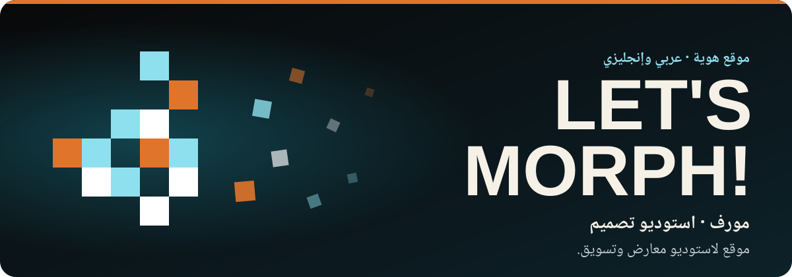
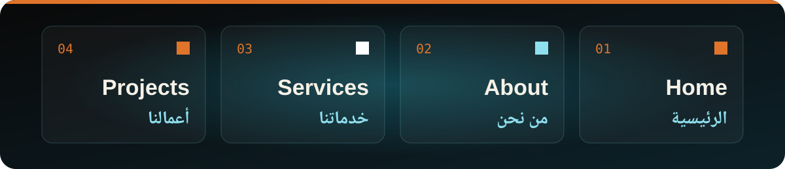

[English](README.md) · **العربية**

موقع هوية لاستوديو مورف، المتخصص في تصميم المعارض والمؤتمرات وتنفيذها، والتسويق الإلكتروني، وإدارة حسابات التواصل الاجتماعي. صفحة واحدة بخلفية داكنة، وكل قسم فيها يحمل اسمه بالعربية والإنجليزية معًا.

تصميم وتطوير: **محمد الطنسي** · [لينكدإن](https://www.linkedin.com/in/mohammed-altounsi/)

## ماذا في الصفحة

- **الرئيسية:** زجاج قزحي ثلاثي الأبعاد يملأ الشاشة، وفوقه عنوان كبير "&lrm;LET'S MORPH!&lrm;"
- **من نحن:** تعريف بالاستوديو وأهدافه الأربعة، بالعربية والإنجليزية
- **خدماتنا:** خدمات الجرافيك والتسويق والفعاليات
- **أعمالنا:** معرض أعمال في ثلاث مجموعات: المعارض والمؤتمرات، والهويات التجارية، والدعاية والإعلان
- **تواصل معنا:** طرق سريعة للتواصل مع الاستوديو، وزر "تواصل معنا" في أعلى الصفحة

## عربي أولًا

- العربية في المقدّمة: القائمة تقرأ الرئيسية · من نحن · خدماتنا · أعمالنا، وبجانبها زر `En` للتبديل
- كل عنوان يجمع اللغتين: خدماتنا مع Our Services، ومعرض الأعمال مع Featured Portfolio
- على الجوال تنطوي القائمة خلف زر `+`، ويحتفظ العنوان بعرض الشاشة كاملًا

---

> نموذج تصميم وواجهة أمامية. تبغى موقعًا بهذا المستوى لعلامتك؟ تواصل معي على [لينكدإن](https://www.linkedin.com/in/mohammed-altounsi/).

