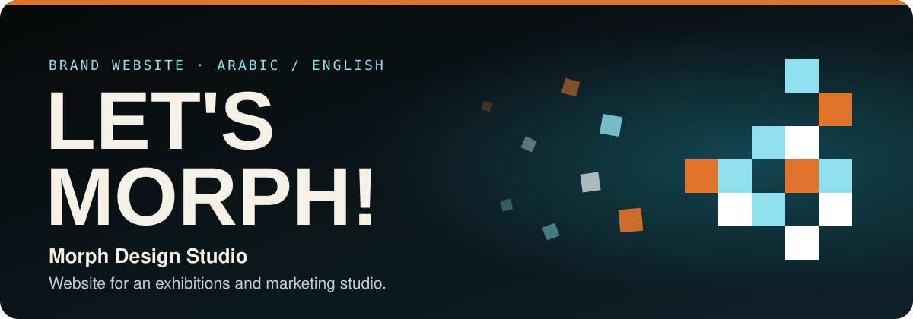
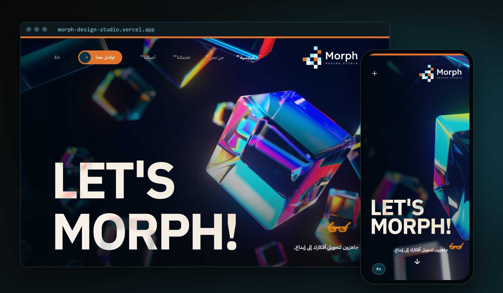
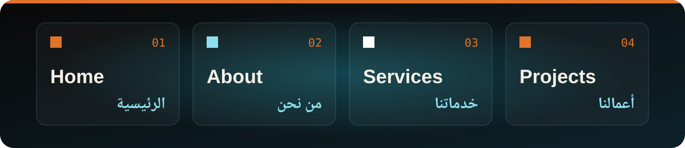

**English** · [العربية](README.ar.md)

Brand site for Morph, a studio that designs and runs exhibitions and conferences and handles digital marketing and social media for brands. One dark page, and every section carries its Arabic and English names together.

Designed and built by **Mohammed Altounsi** · [LinkedIn](https://www.linkedin.com/in/mohammed-altounsi/)

## What's on the page

- **Home:** full-bleed 3D iridescent glass under an oversized "LET'S MORPH!" headline
- **About:** who the studio is and its four goals, in Arabic and English
- **Services:** graphic, marketing and event services
- **Projects:** a portfolio in three groups: conferences and exhibitions, brand identities, and advertising
- **Contact:** quick ways to reach the studio, plus a contact button in the header

## Built Arabic-first

- Arabic leads: the navigation is in Arabic, with an `En` switch beside it
- Every heading pairs both languages: Our Services with خدماتنا, Featured Portfolio with معرض الأعمال
- On mobile the menu folds behind a `+` button and the headline keeps the full screen width

---

> A design and front-end showcase. For a site at this level for your brand, reach me on [LinkedIn](https://www.linkedin.com/in/mohammed-altounsi/).
